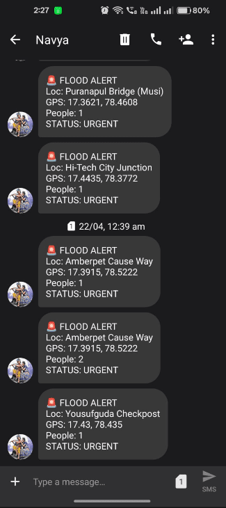
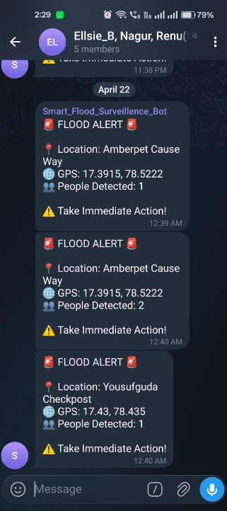
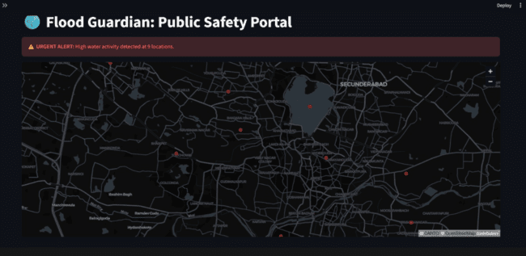
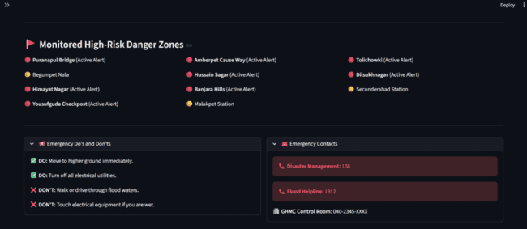
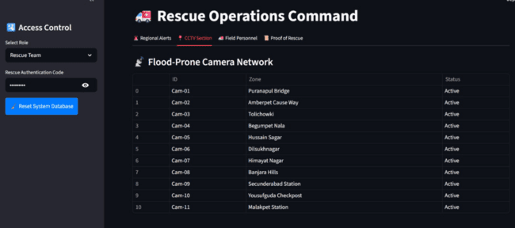

# 🌊 AI-Powered Flood Surveillance and Automatic Alert Mechanism System

An intelligent flood surveillance system that uses computer vision to detect people in distress during flood events and automatically alerts rescue teams via SMS, Email, and Telegram.

---

## 📌 Overview

Flood Guardian monitors live CCTV footage across multiple flood-prone locations in Hyderabad. It uses a fine-tuned YOLO26s model combined with Re-Identification (ReID) tracking to detect and uniquely track individuals caught in floodwaters — then instantly notifies rescue teams with GPS coordinates.

---

## ✨ Features

- **Real-time Person Detection** using a custom-trained YOLO26s model (`yolo26s.pt`)
- **Re-Identification (ReID) Tracking** via OSNet (`osnet_x0_25_msmt17.pt`) to avoid duplicate alerts
- **Multi-channel Alerts** — SMS, Email, and Telegram notifications sent on detection
- **Streamlit Dashboard** with two roles:
  - **Public User** — View active flood alerts and affected regions
  - **Rescue Team** — Manage alerts, view CCTV feeds, track field personnel, and review rescue proof
- **SQLite Database** to log all detection events with person ID, location, GPS, and status
- **12 CCTV Nodes** mapped to real flood-prone locations across Hyderabad
- **Proof of Rescue** — Cropped images of detected individuals saved for documentation

---

## 🗂️ Project Structure

```
flood_survelleince/
│
├── app_interface.py          # Streamlit dashboard (Public + Rescue Team views)
├── tracking_reid.py          # YOLOv11 + ReID detection & alert engine
├── train_flood.py            # YOLO26s model training script
├── clean_dataset.py          # Dataset cleaning utility
├── database_manager.py       # SQLite database helpers
├── email_handler.py          # Email alert sender (Gmail SMTP)
├── sms_handler.py            # SMS alert sender + Email/Telegram trigger queue
├── telegram_handler.py       # Telegram bot alert sender
├── launch_all.py             # Launch all CCTV nodes in parallel
├── custom_tracker.yaml       # BoxMOT tracker configuration
│
├── yolo26s.pt                # Fine-tuned YOLOv11 detection model
├── osnet_x0_25_msmt17.pt     # OSNet ReID weights
├── flood_guardian.db         # SQLite database (auto-created)
│
├── baseline1.v1-baseline1.yolov11/   # Training dataset (Roboflow, CC BY 4.0)
│   ├── data.yaml
│   ├── train/
│   └── test/
│
├── input/videos/             # Input CCTV test videos (test_video_01.mp4 ... 12.mp4)
└── detected_people/          # Cropped images of detected persons (auto-generated)
```

---

## 🏙️ Monitored Locations (Hyderabad)

| Node | Location | GPS |
|------|----------|-----|
| 01 | Puranapul Bridge (Musi) | 17.3621, 78.4608 |
| 02 | Amberpet Cause Way | 17.3915, 78.5222 |
| 03 | Tolichowki - Nadeem Colony | 17.4010, 78.4095 |
| 04 | Begumpet Nala | 17.4424, 78.4624 |
| 05 | Hussain Sagar Lake Drain | 17.4230, 78.4750 |
| 06 | Dilsukhnagar Metro Area | 17.3685, 78.5247 |
| 07 | Himayat Nagar Main Road | 17.3990, 78.4830 |
| 08 | Banjara Hills Rd No. 10 | 17.4120, 78.4410 |
| 09 | Secunderabad Station Underpass | 17.4330, 78.5010 |
| 10 | Yousufguda Checkpost | 17.4300, 78.4350 |
| 11 | Malakpet Station Road | 17.3788, 78.4979 |
| 12 | Hi-Tech City Junction | 17.4435, 78.3772 |

---

## ⚙️ Installation

### Prerequisites

- Python 3.10+
- pip

### Setup

```bash
git clone https://github.com/your-username/flood_survelleince.git
cd flood_survelleince

pip install ultralytics boxmot streamlit opencv-python scipy pandas numpy requests
```

> Make sure `yolo26s.pt` and `osnet_x0_25_msmt17.pt` are present in the project root. These are the detection and ReID model weights.

---

## 🚀 Usage

### 1. Run the detection engine (all 12 CCTV nodes)

```bash
python launch_all.py
```

This starts detection threads for all video nodes in parallel. Alerts are logged to `flood_guardian.db` and notifications are sent automatically.

### 2. Launch the dashboard

```bash
streamlit run app_interface.py
```

Open `http://localhost:8501` in your browser.

- **Public User**: No login required — view active flood alerts by region.
- **Rescue Team**: Enter the authentication code (`rescue123`) to access the full command dashboard.

### 3. (Optional) Retrain the model

```bash
python train_flood.py
```

---

## 🔔 Alert Channels

Alerts are triggered when a new person is detected at a flood-prone location. Each alert includes:
- Location name
- GPS coordinates
- Number of people detected

| Channel | Handler |
|---------|---------|
| 📧 Email | `email_handler.py` (Gmail SMTP) |
| 📱 SMS | `sms_handler.py` (SMS Gateway API) |
| 💬 Telegram | `telegram_handler.py` (Telegram Bot API) |

> **Note:** Update credentials in `email_handler.py`, `sms_handler.py`, and `telegram_handler.py` before deployment.

---

## 🧠 Model & Dataset

- **Model**: YOLO26s fine-tuned on a drowning/flood person detection dataset
- **Dataset**: [baseline1 on Roboflow Universe](https://universe.roboflow.com/mersi-lab/baseline1) — Licensed under CC BY 4.0
- **ReID**: OSNet-x0.25 trained on MSMT17 (via BoxMOT)

---

## 📦 Dependencies

| Package | Purpose |
|---------|---------|
| `ultralytics` | YOLOv11 inference & training |
| `boxmot` | Multi-object tracking + ReID |
| `streamlit` | Dashboard UI |
| `opencv-python` | Video frame processing |
| `scipy` | Cosine similarity for ReID |
| `sqlite3` | Alert database (built-in) |
| `requests` | SMS gateway API calls |

---

## 📸 Screenshots

### 🔔 Alert Notifications

**SMS Alert**


**Email Alert (Received)**


**Telegram Alert**


---

### 📊 Dashboard

**Public Safety Portal**


**Public Do's & Don'ts Panel**


**Rescue Team — Regional Alerts**


**Rescue Team — Operations View**


---

### 🧠 Model Performance

**Detection Metrics**


**Precision-Recall Curve**


**F1 Score Curve**


---

## 🤝 Contributing

Pull requests are welcome. For major changes, please open an issue first to discuss what you'd like to change.

---

## 📄 License

This project is for academic and research purposes. The training dataset is licensed under [CC BY 4.0](https://creativecommons.org/licenses/by/4.0/).
